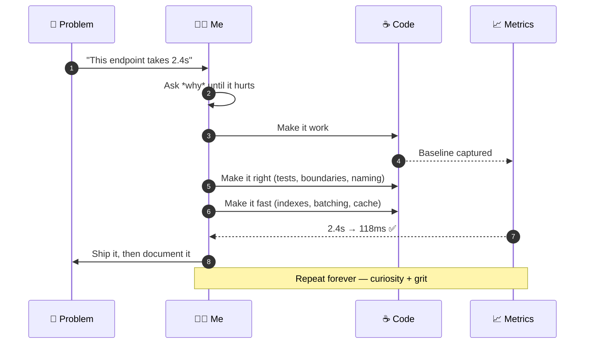
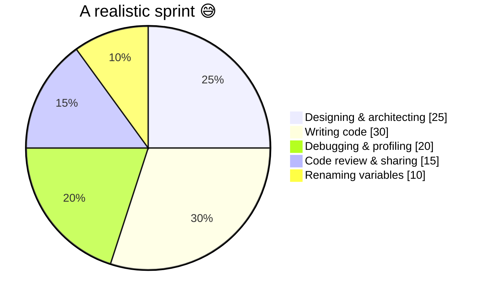

<!-- ═══════════════════════════════ HEADER ═══════════════════════════════ -->
<div align="center">


<a href="https://www.linkedin.com/in/yassinghariani/">
  
</a>

<br/>

<a href="https://www.linkedin.com/in/yassinghariani/"></a>
<a href="https://github.com/Dastanoyx?tab=followers"></a>


</div>

<br/>

<!-- ═══════════════════════════════ ABOUT ═══════════════════════════════ -->

##  &nbsp;`whoami`


```java
@Component
@Slf4j
public class Yassin implements SoftwareEngineer {

    private static final String ROLE     = "Backend Engineer";
    private static final String DOMAIN   = "Fintech 🏦";
    private static final String LOCATION = "Tunisia 🇹🇳";
    private static final String MOTTO    = "Build. Learn. Share. Repeat.";

    private final Stack<String> weapons = new Stack<>(List.of(
            "Java", "Spring Boot", "Kafka", "PostgreSQL", "Docker", "K8s"
    ));

    @Override
    public void dailyRoutine() {
        while (curious) {
            build();      // scalable, fault-tolerant systems
            learn();      // new stacks & design patterns
            share();      // ideas, war stories, code reviews
            refactor();   // because "good enough" never is
        }
    }

    @Scheduled(cron = "0 0 3 * * *")
    public void debugSideProjectGoneRogue() {
        log.warn("It worked on my machine 😅");
    }
}
```

<br clear="right"/>

> I'm a backend engineer who turns messy, complex problems into systems that are **fast, safe and boring to operate** — the highest compliment infrastructure can receive.
> I live at the intersection of **clean code**, **smart design** and **relentless optimization**, and I'm obsessed with the *why* behind every line.

<br/>

<!-- ═══════════════════════════════ FOCUS ═══════════════════════════════ -->

## 🎯 &nbsp;Current Focus

<table>
<tr>
<td width="33%" align="center">
<br/>
<b>🔭 Building</b><br/>
<sub>Fault-tolerant microservices &<br/>event-driven fintech pipelines</sub>
</td>
<td width="33%" align="center">
<br/>
<b>🌱 Learning</b><br/>
<sub>System design at scale,<br/>JVM tuning & observability</sub>
</td>
<td width="33%" align="center">
<br/>
<b>👯 Collaborating on</b><br/>
<sub>Performance-driven backends,<br/>scalable & resilient APIs</sub>
</td>
</tr>
</table>

<br/>

<!-- ═══════════════════════════ ARCHITECTURE ════════════════════════════ -->

## 🏗️ &nbsp;How I Think About Systems

<div align="center">
  
</div>

<sub>☕ Spring Boot services publish, Kafka carries, consumers react. Everything is idempotent, everything is traced, and no two services share a database.</sub>

<br/>

<!-- ═══════════════════════════ ENGINEERING LOOP ════════════════════════ -->

## 🔁 &nbsp;My Engineering Loop

<div align="center">
  
</div>

<details>
<summary><b>📖 The same loop, told as a request lifecycle</b></summary>

<br/>



</details>

<br/>

<!-- ═══════════════════════════ TECH STACK ═════════════════════════════ -->

## 🧰 &nbsp;Tech Stack

<div align="center">
  
</div>

<br/>

<div align="center">

**☕ Core Languages**


**🍃 Backend & Frameworks**


**📨 Messaging & Big Data**


**🗄️ Databases**


**🚀 DevOps & Infrastructure**


**📊 Data Science & Quality**


**🎨 Frontend & Tools**


</div>

<br/>

<!-- ══════════════════════════ WHERE TIME GOES ══════════════════════════ -->

## ⏳ &nbsp;Where My Engineering Time Actually Goes



<br/>

<!-- ═══════════════════════════ GITHUB STATS ════════════════════════════ -->

## 📊 &nbsp;GitHub Analytics

<div align="center">


<br/><br/>


</div>

<br/>

<!-- ══════════════════════════════ SNAKE ═══════════════════════════════ -->

<div align="center">
  <picture>
    <source media="(prefers-color-scheme: dark)" srcset="https://raw.githubusercontent.com/Dastanoyx/Dastanoyx/output/github-snake-dark.svg" />
    <source media="(prefers-color-scheme: light)" srcset="https://raw.githubusercontent.com/Dastanoyx/Dastanoyx/output/github-snake.svg" />
    
  </picture>
</div>

<br/>

<!-- ═══════════════════════════════ QUOTE ══════════════════════════════ -->

<div align="center">

### ✍️ Dev Wisdom of the Day


<br/><br/>

> ### 🧩 *"Make it work, then make it right, then make it fast."*

</div>

<br/>

<!-- ═══════════════════════════════ CONNECT ════════════════════════════ -->

## 🤝 &nbsp;Let's Build Something

<div align="center">

I'm always up for swapping war stories, reviewing an ugly service, or arguing about whether that really needed to be a microservice.

<a href="https://www.linkedin.com/in/yassinghariani/">
  
</a>
&nbsp;
<a href="https://github.com/Dastanoyx">
  
</a>

<br/><br/>

⭐️ *If any of my repos help you, a star goes a long way.*


</div>